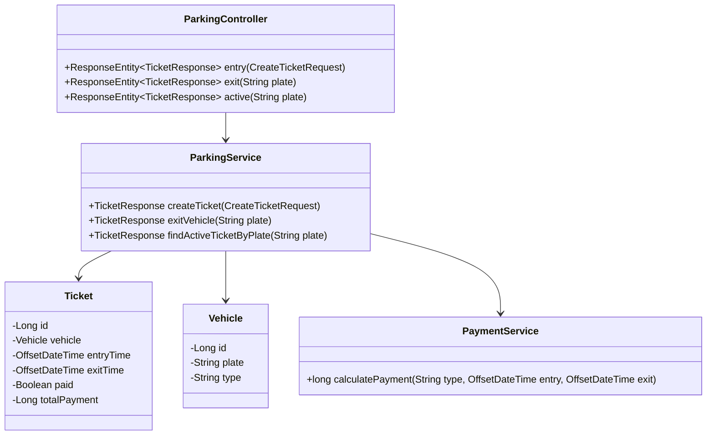

# 📦 Parking Service

[](https://www.oracle.com/java/technologies/javase/jdk17-archive-downloads.html)  
[](https://spring.io/projects/spring-boot)  
[](https://www.postgresql.org/)  
[](https://www.h2database.com/)  

---

## 📋 Descripción

Microservicio encargado de la gestión de parqueaderos. Permite registrar la entrada y salida de vehículos, validando placas colombianas (carros y motos) y calculando el pago según el tiempo de estancia (carro: 100 COP/min, moto: 80 COP/min). Expone una API RESTful con documentación Swagger/OpenAPI y perfiles separados para **local**, **test (H2)** y **docker**.

---

## 🛠️ Tecnologías y Dependencias Clave

- **Spring Boot 3.5.5**
- **Spring Data JPA**: Persistencia de tickets y vehículos.
- **Spring Web**: Creación de endpoints REST.
- **Spring Validation**: Validación de datos de entrada (placas, tipos).
- **PostgreSQL**: Base de datos en entorno local y docker.
- **H2**: Base en memoria para pruebas automáticas.
- **SpringDoc OpenAPI (Swagger UI)**: Documentación interactiva de la API.
- **Spring Boot Actuator**: Endpoints de salud y monitoreo.
- **Lombok**: Reducción de boilerplate.
- **JUnit & Spring Boot Test**: Framework de pruebas.

---

## ⚙️ Configuración

- **Puerto**: `8080`  
- **Context Path**: `/api/v1/parking`  
- **Perfiles**:
  - **local**: PostgreSQL en máquina local.  
  - **test**: H2 en memoria para pruebas.  
  - **docker**: PostgreSQL en contenedor.  

---
## 📐 Diagrama


## 🚀 Instrucciones de Ejecución

### 🐳 Con Docker

Este servicio se ejecuta como parte del `docker-compose.yml` principal. Para ejecutarlo de forma aislada:

```bash
# Desde el directorio raíz del proyecto
docker-compose up --build parking-service
```
### 🧪 Local con Maven
Requiere Java 17 y Maven instalados.
Primero crea la base de datos en PostgreSQL:
```bash
CREATE DATABASE parkingdb;
```
Luego ejecuta:
```bash
./mvnw spring-boot:run -Dspring-boot.run.profiles=local
```
El servicio estará disponible en:
http://localhost:8080/api/v1/parking

Swagger UI:
http://localhost:8080/swagger-ui.html

📡 Endpoints
1️⃣ Registrar entrada
POST /api/v1/parking/entry
Registra la entrada de un vehículo.
Body:
```bash
{
  "plate": "AAA111",
  "type": "CAR"
}
```
Response (éxito):
```bash
{
  "id": 1,
  "plate": "AAA111",
  "type": "CAR",
  "entryTime": "2025-09-16T14:00:00Z",
  "paid": false,
  "totalPayment": null
}
```
Response (error - placa duplicada):
```bash
{
  "errors": [
    {
      "status": "400",
      "title": "Active Ticket Exists",
      "detail": "A vehicle with plate AAA111 already has an active ticket"
    }
  ]
}
```
2️⃣ Registrar salida
POST /api/v1/parking/exit/{plate}
Registra la salida y calcula el pago total.
Response (éxito):
```bash
{
  "id": 1,
  "plate": "AAA111",
  "type": "CAR",
  "entryTime": "2025-09-16T14:00:00Z",
  "exitTime": "2025-09-16T15:30:00Z",
  "paid": true,
  "totalPayment": 9000
}
```
Response (error - vehículo no encontrado):
```bash
{
  "errors": [
    {
      "status": "404",
      "title": "Ticket Not Found",
      "detail": "No active ticket found for plate: BBB222"
    }
  ]
}
```
3️⃣ Consultar ticket activo
GET /api/v1/parking/active/{plate}
Consulta el ticket activo de un vehículo.
Response (éxito):
```bash
{
  "id": 1,
  "plate": "AAA111",
  "type": "CAR",
  "entryTime": "2025-09-16T14:00:00Z",
  "paid": false,
  "totalPayment": null
}
```
Response (error - no existe ticket):
```bash
{
  "errors": [
    {
      "status": "404",
      "title": "Ticket Not Found",
      "detail": "No active ticket found for plate: CCC333"
    }
  ]
}
```
Consulta el ticket activo de un vehículo dentro del parqueadero.

## 🧪 Pruebas
Las pruebas unitarias e integración se encuentran en src/test.

Unitarias: validan reglas de negocio (PaymentService, ParkingService).

Integración: flujo completo usando H2 en memoria.

Para ejecutarlas:
```bash
./mvnw test
```
📂 Colección de Postman
Archivo: ParkingService.postman_collection.json
```bash
{
  "info": {
    "name": "Parking Service",
    "_postman_id": "parking-service-collection",
    "description": "Colección de endpoints del Parking Service con variables de entorno",
    "schema": "https://schema.getpostman.com/json/collection/v2.1.0/collection.json"
  },
  "variable": [
    {
      "key": "baseUrl",
      "value": "http://localhost:8080/api/v1/parking"
    }
  ],
  "item": [
    {
      "name": "Registrar Entrada",
      "request": {
        "method": "POST",
        "header": [{ "key": "Content-Type", "value": "application/json" }],
        "url": "{{baseUrl}}/entry",
        "body": {
          "mode": "raw",
          "raw": "{\n  \"plate\": \"AAA111\",\n  \"type\": \"CAR\"\n}"
        }
      }
    },
    {
      "name": "Registrar Salida",
      "request": {
        "method": "POST",
        "header": [],
        "url": "{{baseUrl}}/exit/AAA111"
      }
    },
    {
      "name": "Consultar Ticket Activo",
      "request": {
        "method": "GET",
        "header": [],
        "url": "{{baseUrl}}/active/AAA111"
      }
    }
  ]
}
```
## 📄 Licencia
Este proyecto está licenciado bajo la Licencia "".

